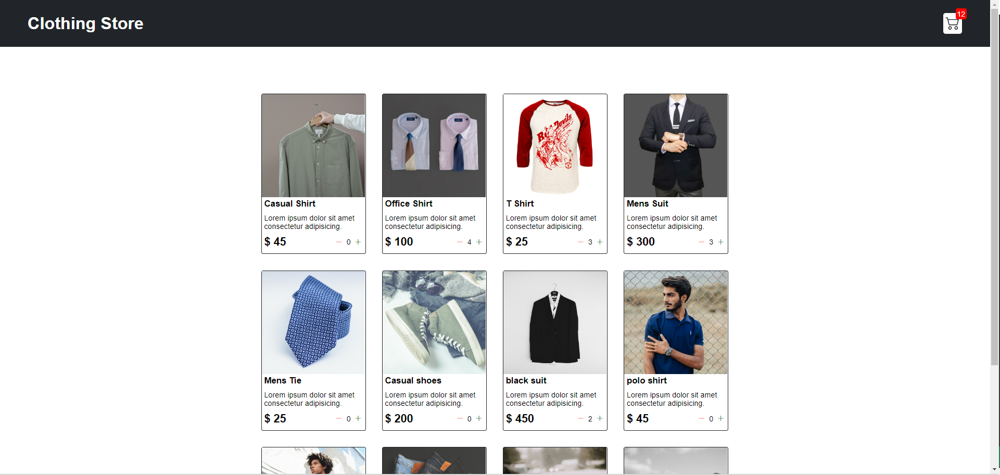
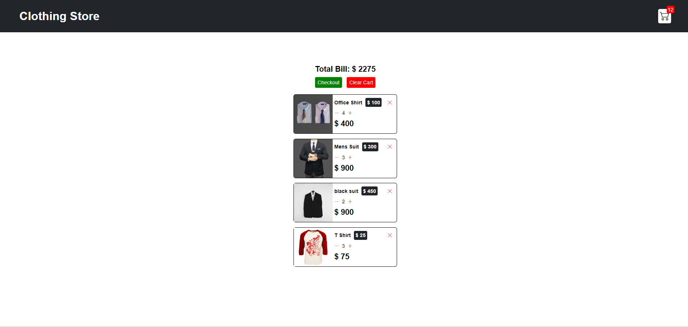

# Shopping-Cart
This is a lightweight project that implements a shopping cart functionality with help of JavaScript. It features a user-friendly webpage designed with HTML and CSS.This project provides a clean and intuitive interface for users to browse products, add them to the cart, and manage their shopping selections seamlessly. It serves as an excellent starting point for developers looking to understand and build a simple e-commerce experience with core web technologies.

# Output

## product-page 

## cart-page
